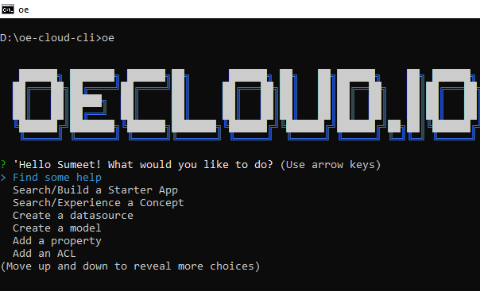
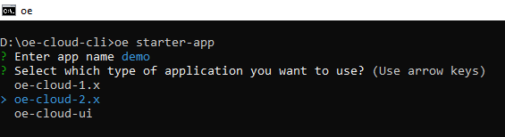
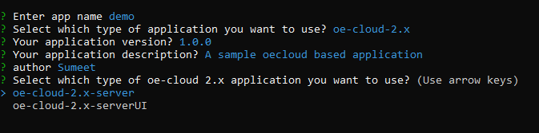
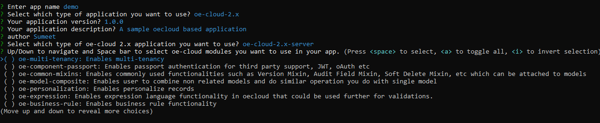
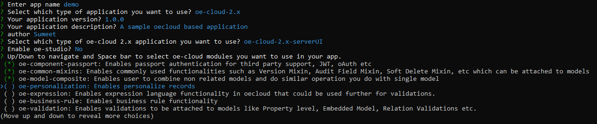
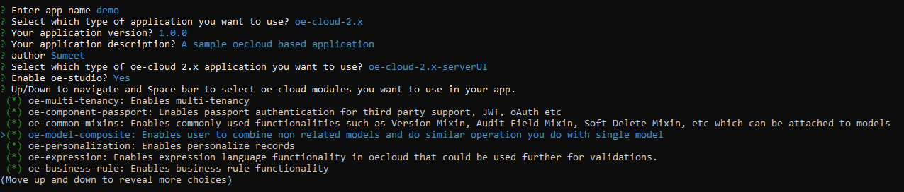
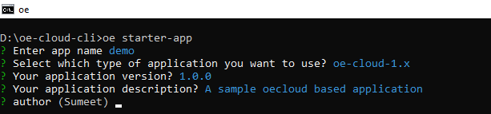
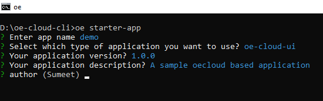

# oe-cloud-cli


***CLI for scaffolding oe-cloud based applications.***

> This project is modification of original project [yeoman/yo](https://github.com/yeoman/yo)

> This project is changed from original project for,

* Changing the route
* Adding organisation specific documentation in help section
* Changing code to make it work with corporate proxy
* Organisation branding added

Please visit [yeoman/yo](https://github.com/yeoman/yo) for original documentation.

## Installation

```sh

# install oe-cloud-cli
$ npm install -g oe-cloud-cli


# start cli
$ oe

```




## Use

### Scaffold a new application

1. Run `oe starter-app` to create a new oe-cloud application.

    ```sh
      $ oe starter-app
    ```

   
2. The oe-Cloud application generator will  prompt you for the name of the application. For example, type **demo** as the name of the application 

    

3. Select what kind of application you want to create

    3.1 If selecting **oe-cloud-2.x** (default selection)
    
       

       3.1.1 If selecting **oe-cloud-2.x-server**
            
            

       3.1.2 If selecting **oe-cloud-2.x-serverUI**
             
            

       3.1.3 If selecting **oe-cloud-2.x-serverUI** and **Enable oe-studio**
       
            
        
     *Press Enter to accept default value of Application Description, Version and Author. For oe-cloud 2.0 application, select oe-cloud modules from the checklist using Space Bar Button*.

    3.2 If selecting **oe-cloud-1.x**
      
       
        
     *Press Enter to accept default value of Application Description, Version and Author*.

     3.3 If selecting **oe-cloud-ui**
      
       
        
     *Press Enter to accept default value of Application Description, Version and Author*.


4. The generator will then display messages as it scaffolds the application including:

     4.1 Initializing the project folder structure.

     4.2 Creating default JSON and JS files.

     4.3 Downloading and installing dependent Node modules (as if you had manually done npm install).
     

5. Run `node .` to start the scaffolded server for **oe-cloud 1.x** and **oe-cloud 2.x** application

6. Run `npm start` to start **oe-cloud ui** application


## What's oe-cloud-cli?

oe-cloud-cli helps you to kickstart new projects, prescribing best practices and tools to help you stay productive.

## Advanced CLI options

oe-cloud-cli provides the option to create model, datasource, property, relation, acl and middleware.

```sh
# cli to create datasource
$ oe create datasource

# cli to create model
$ oe create model

# cli to create property
$ oe create property

# cli to create relation
$ oe create relation

# cli to create acl
$ oe create acl

# cli to create middleware
$ oe create middleware

```

oe-cloud-cli also enables the user to perform few basic oe cloud functionalities from command line.

* default-ui: Allows the user the generate default UIRoute,NavigationLink and UIComponent for the selected Model.
* ui-route: Allows the user to enter initial data for UIRoute model
* navigation-link: Allows the user to enter initial data for NavigationLink model
* workflow: Allow user the attach workflow to a model from the selected list
* business-rules: Allow user to attach the business-rules to the model.

```sh
# cli to define default UI
$ oe define default-ui

# cli to define UI route
$ oe define ui-route

# cli to define navigation link
$ oe define navigation-link

# cli to attach workflow to model
$ oe attach workflow

# cli to attach business rule to model
$ oe attach business-rules

```